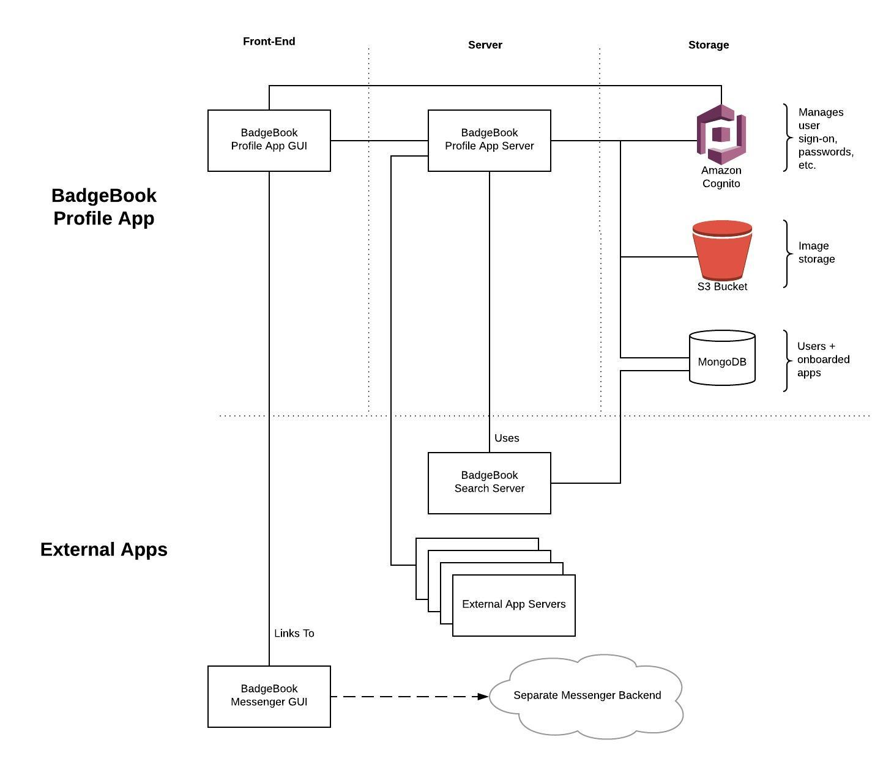

# Badgebook Profile CORE - Architecture

- [Architecture Overview](#architecture-overview)
- [Call Flows](#Call-Flows)
    - [Badge Display](#Badge-Display)
    - [Core App Authentication](#Core-App-Authentication)
    - [Images](#Images)
    - [Permission System](#Permission-System)
    - [Search](#Search)
    - [Single Sign On](#Single-Sign-On)
    - [Inter-App Communication](#Inter-App-Communication)

## Architecture Overview
The core application follows a standard 3-tier architecture. The front-end consists of a two separate GUI folders, a NodeJS server, and three separate services for storage.

## Call Flows
High-level details of how a few of the more interesting processes in our ecosystem work.

### Badge Display
Each user's profile is public, and displays "badges" - snippets of information about the external applications that each user uses (think achievements on XBox/Playstation). Here is the high-level process of how that works:

1. Someone loads a user's profile. The server serves up the React application, which populates the HTML page and makes the appropriate API calls to our server. One of these is the `/api/user/<user-id>/badge-data` endpoint.
2. The server goes gets a list of the onboarded applications from the database. It also gets a list of all granted permissions for the current user, checking for each application to see if the user has granted permission to that app.
3. The server then makes API requests to each permitted external app's API, passing the user ID and the external app's application token.
4. The server compiles all the results, then returns the results up to the front-end.
5. The React application receives the compiled results and updates the view, fetching icons for each badge from the provided URL.

### Core App Authentication
The core application uses AWS Cognito as a user management service. Users log in using the AWS Cognito SDK via the front end, which stores their access tokens in the browser. These are then passed down to the server with each request, where our security filter validates them on each request.

### Images
Image upload and hosting is handled through AWS S3. This provides public read access, while limiting write access to our server.

1. A user uploads an image through the GUI. The React application makes a request to the core app's API, which downloads the image.
2. The core API renames the image with the user's ID, then uploads the renamed image to our AWS S3 bucket. Note our bucket has public read access, but only the server has the credentials necessary to upload.
3. After the upload is complete, the API responds to the user's request.
4. The React application refreshes the image, downloading the new one and updating the UI.

### Permission System
Our application server is written using ExpressJS, and our permission system is implemented as a piece of middleware. This runs on every incoming request and performs three main functions:

1) Determines the source of the request. Who is requesting the data? Every client is either anonymous, or has a unique ID. We refer to this as the `clientId`. This is done by checking for tokens, and then validating those tokens using the appropriate means (for user tokens, it's the AWS Cognito SDK. For application tokens, we just check if the token is present in the database).
2) Determines the resource being requested. What is the user trying to access? This might be a request to write to the user's badge endpoint, read a user's data, etc. We call this the `resourceId`.
3) Takes the request's `path`, the `clientId`, and `resourceId`, and checks those against two things: 1) The list of publically available endpoints, and 2) The permission settings for the given `clientId`/`resourceId` pair (stored in the database). Any unauthorized requests are responded to with a `401` status.

For more information on the permission system, see [Security Filter](./security-filter.md).

### Search
Our search is split into two separate systems.

The first (hosted in on a separate [Search Server](https://github.com/cloudseption/search-api)) is responsible for searching our database of users, and returning a list of user IDs that match.

The second (the advanced search) is built for specific queries, such as finding the top 20% of all users who have taken JavaScript quizzes. This is handled by querying external applications and asking for user IDs that match the query (delegates the implementation details to the external applications).

### Single Sign On
Single Sign On (SSO) allows users of the core BadgeBook app to log into all of the connected applications using the same account. Here's the flow:

1. User goes to an external app for the first time. The external app checks for a BadgeBook token and, seeing the user doesn't have one, redirects them to the BadgeBook server's `/auth/token.html` page. In the search params, it passes the page the user is currently on, base-64 encoded, along with the it's **public key**.
2. The BadgeBook app's `/auth/token.html` page loads and checks to see if the user is logged into BadgeBook (remember that's handled by AWS Cognito). If not, the user is presented with the sign-on screen.
3. Once the user is logged in to BadgeBook, the front-end next grabs the application's **public key** (passed through the URL), and asks the server to get the current user a token for that app.
4. The server first validates the user's Cognito token, then looks up the external app by its **public key**, and checks to see if the user has already enrolled in it. If it is, the app goes to step 6. If not, it grabs a list of the permissions the app needs from the database, then sends this up to the GUI (step 5).
5. The GUI displays the permissions required and asks the user if they are willing to grant them. Once the user clicks yes, the GUI calls the BadgeBook server, which writes those permissions into the database. [Go back to 4 and try getting the access token again]
6. The server creates a new JWT (JSON Web Token), signed with the external application's **private key**. This access token is signed, so the external application can verify that it originated on the BadgeBook server. This token is returned to the GUI.
7. The GUI receives the token, parses the redirect URL (by decoding it from base 64), then encodes the token and attaches it as a queryparam. This is then used to redirect to the external application, with the token attached.
8. The external application's GUI loads. A script pulls the token out of the URL and stores it in cookies. As cookies are passed automatically with every request, no further client-side logic is required by the external application, unless they explicitly want to grab details from the token.
9. The external application's server checks each request for the token in the cookies, and verifies it.

### Inter-App Communication
In all communications between the servers (for example, the BadgeBook Profile server calls the Search Server), we pass tokens. We're simply passing strings and checking if these match.